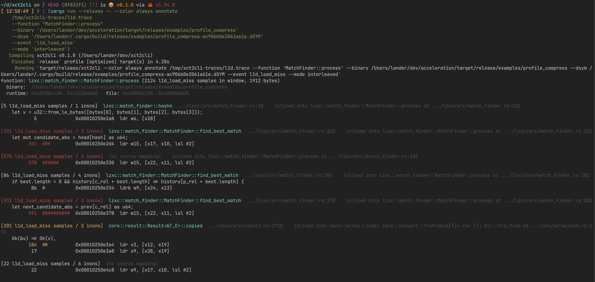

# xct2cli

Library and CLI for transforming Xcode Instruments `.trace` bundles
into output that's useful to humans **and** LLMs. Apple Silicon only.

The crate is library-forward: `xct2cli` (the binary) is a thin `clap`
shell over `xct2cli` (the lib). Other tools can depend on the lib with
`default-features = false` to skip the CLI deps.

**NOTE:** This is kind of some LLM bullshit. I kept having Claude Code
use Instruments to profile code and it would always create a Python
script to interpret the results. This project is my attempt to kill the
Python script it would always generate, and get richer info at the same
time.

## Requirements

- macOS with Xcode (`/usr/bin/xctrace` ships with it).
- Apple Silicon for the disassembler (we use `capstone` in arm64 mode).
- Optional: `cargo-instruments` for recording from Cargo projects.

## Commands

```
xct2cli toc       <trace>                          # what's in the bundle
xct2cli hotspots  <trace> [--binary BIN] [--dsym DSYM]
xct2cli slide     <trace> [--binary BIN] [--dsym DSYM]
xct2cli annotate  <trace> --function NAME [--mode interleaved] [--event NAME | --metric N]
xct2cli counters  <trace> [--sort-by N]
xct2cli events    <trace>                          # list metric / pmi-event names
xct2cli record    -t TEMPLATE -o OUT.trace -- ./bin args
```

Global flags: `--color {auto,always,never}` (auto-detect TTY + honor
`NO_COLOR`), `--verbose`, `--json` on every command for
machine-readable output. ASLR slide is recovered automatically from the
trace's kdebug image-load events whenever `--binary` or `--dsym` is
provided; `xct2cli slide` is the escape hatch when that fails.

## Time profile (Time Profiler trace)

```sh
xct2cli record -t "Time Profiler" -o /tmp/run.trace -- \
    target/release/examples/profile_compress
xct2cli toc /tmp/run.trace
```

```
run #1
  template: Time Profiler
  duration: 1.354983s
  device:   caladan (MacBook Pro, 26.4 (25E246))
  process:  profile_compress (pid 85408)
  processes:
    pid     0  kernel  /System/Library/Kernels/kernel.release.t8142
    pid 85408  profile_compress  /Users/lander/dev/acceleration/target/release/examples/profile_compress
  tables (40):
    tick
    time-sample
    time-profile
    kdebug
    ...
```

```sh
xct2cli hotspots /tmp/run.trace
```

```
samples: 500
per CPU:
  CPU 0 CPU 0 (E Core)              1 samples
  CPU 6 CPU 6 (S Core)            152 samples
  CPU 7 CPU 7 (S Core)            118 samples
  CPU 8 CPU 8 (S Core)            111 samples
  CPU 9 CPU 9 (S Core)            118 samples

timeline (10ms buckets, 51 buckets):
  ms_off cpu0 cpu6 cpu7 cpu8 cpu9
       0     0     2     1     3     2
      40     0     6     0     4     0
      70     0     9     0     0     1
     130     0     8     2     0     0
     ...

top 25 PCs:
      94  0x0000000100ac249c  lzxc::match_finder::MatchFinder::process  match_finder.rs:202
      68  0x0000000100ac237c  lzxc::match_finder::MatchFinder::process  match_finder.rs:182
      38  0x0000000100ac2460  lzxc::match_finder::MatchFinder::process  match_finder.rs
      31  0x0000000100ac236c  lzxc::match_finder::MatchFinder::process  match_finder.rs:182
       ...
```

Then drill into the hottest function:

```sh
xct2cli annotate /tmp/run.trace --function MatchFinder::process --mode interleaved
```

`--mode interleaved` groups consecutive instructions by their innermost
inlined source location, prints stats + function + source per group,
then the asm:

```
[931 samples / 3 insns]  lzxc::match_finder::MatchFinder::find_best_match  match_finder.rs:278    inlined into MatchFinder::process at match_finder.rs:182
    let next_candidate_abs = prev[c_rel] as u64;
          931  ##########  0x10250e378  ldr w15, [x22, x11, lsl #2]
```

(`--mode source` collapses to just the `annotate-snippets` source-line
callouts; `--mode instructions` is the asm-first default with a
source-snippet block at the end.)

## Per-instruction cache miss attribution (CPU Counters trace)

For literal cache miss attribution you need a `.tracetemplate`
configured for PMI-overflow sampling on a memory event. Two are
checked in under `templates/`:

- `templates/L1D_Miss.tracetemplate` — Apple's Guided "L1D Miss
  Sampling" mode. Captures `l1d_load_miss`, `l1d_store_miss`,
  `l1d_tlb_miss` events with full callstacks at the PMI overflow.
- `templates/l2_miss.tracetemplate` — Manual mode sampling
  `PL2_CACHE_MISS_LD` (Apple Silicon's per-cluster L2). Manual mode
  doesn't capture per-PMI callstacks, so PCs are recovered by joining
  each PMI sample to the nearest `time-sample` row from the
  co-recorded Time Profiler.

```sh
xct2cli record -t templates/L1D_Miss.tracetemplate -o /tmp/l1d.trace -- \
    target/release/examples/profile_compress
xct2cli events /tmp/l1d.trace
```

```
metrics (use with `annotate --metric N` or `counters --sort-by N`):
  [0]  Cycles
  [1]  L1D Cache Load Misses
  [2]  L1D Cache Store Misses
  [3]  L1D TLB Misses

pmi events (use with `annotate --event NAME`):
  l1d_load_miss              2473   61.2%
  l1d_store_miss             1546   38.3%
  l1d_tlb_miss                 20    0.5%
```

```sh
xct2cli annotate /tmp/l1d.trace --function MatchFinder::process \
    --event l1d_load_miss --mode interleaved
```

```
function: lzxc::match_finder::MatchFinder::process (2124 l1d_load_miss samples in window, 1912 bytes)

[301 l1d_load_miss samples / 3 insns]  lzxc::match_finder::MatchFinder::find_best_match  match_finder.rs:262    inlined into MatchFinder::process at match_finder.rs:182
    let mut candidate_abs = head[hash] as u64;
          301  ###         0x10250e2d4  ldr w15, [x17, x10, lsl #2]

[578 l1d_load_miss samples / 1 insns]  (no source mapping)    inlined into MatchFinder::process at match_finder.rs:182
          578  ######      0x10250e330  ldr w15, [x22, x11, lsl #2]

[931 l1d_load_miss samples / 3 insns]  lzxc::match_finder::MatchFinder::find_best_match  match_finder.rs:278    inlined into MatchFinder::process at match_finder.rs:182
    let next_candidate_abs = prev[c_rel] as u64;
          931  ##########  0x10250e378  ldr w15, [x22, x11, lsl #2]
```

In color:



In this trace, 931 of 2124 L1D load misses (44%) come from a single
`prev[c_rel]` read in `find_best_match` at `match_finder.rs:278` — the
hash-chain walk that the compiler inlined into `MatchFinder::process`.

## Adding new templates

`xctrace`'s CLI doesn't expose CPU Counters' Mode dropdown, so any new
sampling mode (e.g. branch-mispredict, store-buffer-stall) needs a
`.tracetemplate` built once in Instruments.app:

1. New Document → Blank → add **CPU Counters** instrument.
2. Configuration **Manual**, Sample By **Events**, pick the Sampling
   Event, set Sample Every (start at 1M; lower if samples are sparse).
3. Add a **Time Profiler** instrument with **High Frequency Sampling**
   on so PMI samples can be joined to a PC.
4. File → Save as Template → put it in `templates/`.

`xct2cli events <trace>` will show whatever event name Apple wrote
into the trace; `--event NAME` works the same as for the bundled
templates.

## Library use

```rust
use xct2cli::trace::TraceBundle;
use xct2cli::analysis::HotspotsBuilder;
use xct2cli::render::Palette;

let bundle = TraceBundle::open("run.trace")?;
let report = HotspotsBuilder::new(&bundle)
    .top(50)
    .binary(Some("target/release/myapp".into()))
    .run()?;
println!("{}", report.to_text(Palette::new(false)));
```

Most data-extraction helpers are inherent methods on `TraceBundle`:
`pc_samples`, `pmi_samples`, `pmi_event_names`, `metric_labels`,
`per_pc_pmi_count`, `per_pc_metric_deltas`, `image_loads`,
`counters_profile_event`. `BinaryInfo::open(path)` parses Mach-O and
exposes `slide_from(&loads)` for ASLR-slide detection.
